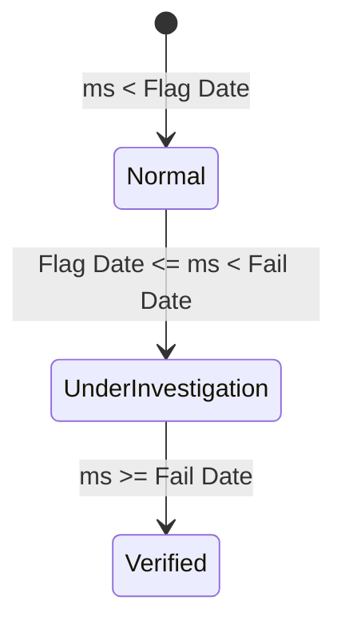

# Analytics & Data Model Reference

This document covers the core mathematical algorithms, telemetry analytical rules, priority index heuristics, RCA lifecycle state machines, dataset structures, and incident similarity logic in **Capsul (OpsLens)**.

---

## 1. Multi-Signal Anomaly & 3σ Deviation Model

### 1.1 Baseline Calculation
For each asset signal \( j \), baseline mean \( m_j \) and standard deviation \( sd_j \) are calculated from the first 5 weeks of historical readings:

$$\text{Mean } m_j = \frac{1}{5} \sum_{k=0}^{4} v_{j,k}$$

$$\text{Standard Deviation } sd_j = \sqrt{\frac{1}{4} \sum_{k=0}^{4} (v_{j,k} - m_j)^2}$$

*(Enforced floor: \( sd_j = \max(sd_j, |m_j| \times 0.005) \))*

### 1.2 Normalized Signal Deviation (\( z \)-score)
For any reading \( v_{j,i} \) at week \( i \):

$$z_{j,i} = d_j \cdot \frac{v_{j,i} - m_j}{sd_j}$$

where \( d_j \in \{+1, -1\} \) represents the direction of harmful deviation.

### 1.3 Capsul Multi-Signal Flag Rule
An asset is flagged as **Warning / Degrading (`W`)** when **3 out of 4 signals** exceed \( 3\sigma \) simultaneously in the same week:

$$\text{ns}_i = \sum_{j=0}^{3} \mathbb{I}(z_{j,i} > 3)$$

$$\text{Capsul Flag raised when } \text{ns}_i \ge 3$$

> **Key Difference vs DCS Alarm**: DCS alarms fire when a single parameter crosses a hard threshold (often late). Capsul flags multivariate degradation weeks earlier.

---

## 2. Priority Index Scoring Model (0–100 Heuristic)

The Priority Index ranks active risks in the Command Center. It is computed in `score(asset, status)` (`src/core/analytics.js`):

$$\text{Priority Score} = \min\left(100, \sum_{k=1}^{4} w_k \cdot p_k + \text{Bonus}_{\text{lens}}\right)$$

### Score Drivers:
1. **Criticality Class (\( p_1 \))**: Class A = 100%, Class B = 60%, Class C = 30%.
2. **Signal Agreement (\( p_2 \))**: Ratio of signals beyond \( 3\sigma \) (\( \frac{\text{ns}}{4} \times 100\% \)).
3. **Time to Trip (\( p_3 \))**: Straight-line trend of signals toward trip limit. Near trip = 100%.
4. **Cost if Failed (\( p_4 \))**: Financial loss at stake relative to max asset stake in plant (\( \frac{\text{stake}}{\text{maxStake}} \times 100\% \)).

### Customizable Weights (\( W \)):
- Default: `cr: 20`, `ag: 30`, `tt: 30`, `cs: 20` (Sum = 100).
- Lens Bonus: Lens selection (e.g., HSE or Maintenance) adds situational bonus points to relevant assets.

---

## 3. RCA Lifecycle & Hindsight Machine

The RCA lifecycle (`getRcaLifecycle(assetTag, ms)`) tracks cause confidence across timeline replay:

| Lifecycle State | Replay Date Condition | Confidence Score | Interpretation Text |
| :--- | :--- | :--- | :--- |
| **Not started / Normal** | `ms < flagMs` | `0%` | Equipment operating within baseline parameters. |
| **Under investigation** | `flagMs <= ms < failMs` | `65%` | Early multi-signal degradation detected. Hypothesis formed based on 4P/4M+1E tables. |
| **Verified / Historical RCA**| `ms >= failMs` | `100%` | Post-trip RCA confirms true root cause and exact downtime / financial impact. |

---

## 4. Equipment Asset Master List (`RCA_CONFIG`)

| Asset Tag | Name | Plant Unit | Criticality | Discipline | Primary Anomaly Mechanism |
| :--- | :--- | :--- | :--- | :--- | :--- |
| **`KO-3201`** | Cracked Gas Compressor | Zebu Chemical Unit | Class A | Mechanical | Lube oil water contamination & radial vibration |
| **`PU-2101B`** | Resin Feed Pump | Aurora Resin Plant | Class B | Mechanical | Mechanical seal flush failure & seal face wear |
| **`HE-3301`** | Quench Water Cooler | Nova Utility Plant | Class A | Process | Tube fouling & heat transfer degradation |
| **`PM-4405B`** | Polymer Extruder Gearbox | Oleo Polymer Plant | Class A | Electrical | Bearing spalling & gear mesh vibration |
| **`BL-5702`** | Induced Draft Fan | Oleo Polymer Plant | Class B | Operations | Impeller imbalance & dust build-up |

---

## 5. Incident Similarity Search (`similar(asset, ms)`)

In the Investigate view, the 380 historical incidents (`RAW.INC`) are searched and scored for similarity against the active asset:

$$\text{Similarity Score } M = (40 \text{ if Type matches}) + (35 \text{ if Component matches}) + (25 \text{ if Mechanism matches})$$

Only incidents prior to current replay date `ms` with score \( M \ge 60\% \) are presented.

---

## 6. Business Impact Scenario Model (`renderImpactView`)

$$\text{Avoidable Loss} = \text{Addressable Failures Loss} \times \text{Capture Rate } (\text{cap}\%) \times \text{Loss Avoidance } (\text{red}\%)$$

- **Addressable Failures**: Failure mechanisms exhibiting condition telemetry precursors (vibration, leakage, overheating, fouling, wear, cracking, loosening).
- **Validation Hours Saved**: \(\text{Incidents Caught} \times \text{hrs}\).
